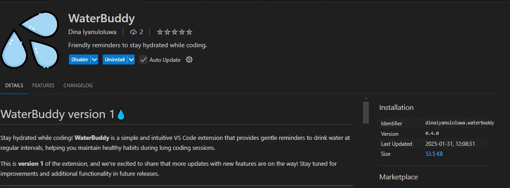

# WaterBuddy version 1💧  

Stay hydrated while coding! **WaterBuddy** is a simple and intuitive VS Code extension that provides gentle reminders to drink water at regular intervals, helping you maintain healthy habits during long coding sessions.

This is **version 1** of the extension, and we’re excited to share that more updates with new features are on the way! Stay tuned for improvements and additional functionality in future releases.

---

## Features  

- 💧 Clean, unobtrusive water break reminders  
- ⏰ Customizable reminder intervals (default: 30 minutes)  
- 🔔 Status bar indicator for quick access  
- 💤 Snooze functionality for busy moments  
- 🎯 Simple toggle on/off mechanism  

The extension adds a water droplet icon (💧) to your status bar, showing the current reminder status. When it’s time for a water break, you’ll receive a friendly notification with options to dismiss or snooze the reminder.

---

## Screenshot

## Requirements  

- Visual Studio Code version 1.80.0 or higher  
- No additional dependencies required  

---

## Extension Settings  

This extension contributes the following settings:  

- `waterReminder.intervalInMinutes`: Set the interval between water break reminders (default: 30 minutes)  

---

## How to Use  

1. The water reminder automatically starts when you open VS Code.  
2. Click the water droplet icon (💧) in the status bar to toggle reminders on/off.  
3. When you receive a reminder, you can:  
   - Click **"Dismiss"** to close the notification.  
   - Click **"Snooze 15min"** to pause reminders for 15 minutes.  
   - Click **"Mark as done"** to acknowledge the reminder.  

---

## Known Issues  

None at this time. If you encounter any issues, please report them at our [GitHub repository](https://github.com/yourusername/water-reminder/issues).  

---

## Release Notes  

### 1.0.0  

**Initial release of WaterBuddy version 1:**  
- Basic water break reminder functionality  
- Customizable intervals  
- Status bar controls  
- Snooze feature  

**Note:** This is the first version of WaterBuddy. More updates with new features and improvements are coming soon!  

---

## Privacy  

This extension does not collect or transmit any user data. All settings are stored locally in your VS Code configuration.  

---

## Contributing  

Found a bug or have a feature request? We’d love to hear from you! Please open an issue or submit a pull request on our [GitHub repository](https://github.com/yourusername/water-reminder).  

---

## License  

This extension is licensed under the [MIT License](LICENSE).  

---

## For More Information  

- [Visual Studio Code's Markdown Support](http://code.visualstudio.com/docs/languages/markdown)  
- [Markdown Syntax Reference](https://help.github.com/articles/markdown-basics/)  

---

**Enjoy coding and stay hydrated! 💧**  

---