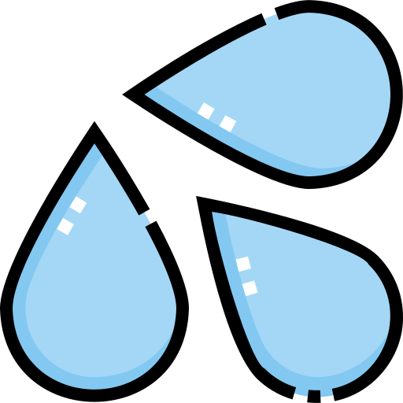

# WaterBuddy 💧  
**Stay Hydrated, Stay Productive!**  
WaterBuddy is a lightweight and intuitive Visual Studio Code extension designed to help developers maintain healthy hydration habits during long coding sessions. With gentle, customizable reminders, WaterBuddy ensures you never forget to take a water break, boosting your productivity and well-being.

---

## Features  

- **💧 Customizable water break reminders**: Receive friendly, unobtrusive notifications to drink water at regular intervals.  
- **🔔 Non-intrusive notifications**: Notifications are designed to be gentle and won't interrupt your workflow.  
- **⏰ Snooze functionality (15 minutes)**: Temporarily pause reminders during intense coding sessions.  
- **📊 Status bar indicator showing reminder state**: A water droplet icon in the status bar indicates the reminder status.  
- **🕒 Last reminder time tracking**: Keep track of when you last received a reminder.  
- **⚙️ Configurable reminder intervals**: Set your preferred reminder frequency (default: 30 minutes).  
- **🛡️ Robust error handling and state management**: Enhanced error handling and state management for a seamless user experience.  

---

## Installation  

1. Open VS Code  
2. Go to Extensions (Ctrl+Shift+X)  
3. Search for "WaterBuddy"  
4. Click Install  

---

## Usage  

1. **Toggle Reminder**:  
   - Click the water drop icon (💧) in the status bar  
   - Or use the command palette (Ctrl+Shift+P) and search for "Toggle Water Reminder"  

2. **Reminder Notifications**:  
   When a reminder appears, you have three options:  
   - "Dismiss": Clear the notification  
   - "Snooze 15min": Pause reminders for 15 minutes  
   - "Mark as Done": Acknowledge that you've had water  

3. **Status Bar Information**:  
   - Shows whether reminders are On/Off/Snoozing  
   - Hover to see time since last reminder  

---

## Configuration  

1. Open VS Code settings (File > Preferences > Settings)  
2. Search for "WaterBuddy"  
3. Adjust the following settings:  
   - `waterBuddy.intervalInMinutes`: Set reminder frequency (1-1440 minutes)  
   Default is 30 minutes  

---

## Testing the Extension  

To test the new features in version 1.1.2:  

1. **Basic Functionality**:  
   - Press F5 to start debugging the extension  
   - Look for the water drop icon (💧) in the status bar  
   - Click it to toggle reminders on/off  

2. **Interval Settings**:  
   - Open VS Code settings  
   - Try setting different intervals (valid: 1-1440 minutes)  
   - Try invalid values to test validation  

3. **State Management**:  
   - Toggle reminders on/off multiple times  
   - Check status bar tooltip for last reminder time  
   - Close and reopen VS Code to test state persistence  

4. **Snooze Feature**:  
   - Wait for a reminder notification  
   - Click "Snooze 15min"  
   - Verify status changes to "Snoozing..."  
   - Check that reminders resume after 15 minutes  

5. **Error Handling**:  
   - Try rapid toggling to test transition protection  
   - Change settings while reminders are active  
   - Check console for any error messages  

---

## Release Notes  

### **Version 1.1.2**  
- **Improved Reliability**: Enhanced error handling and state management.  
- **Better User Experience**: Smoother transitions between reminder states.  
- **Configuration Validation**: Ensures interval settings are within valid ranges.  

### **Version 1.0.0**  
- **Initial Release**: Basic hydration reminder functionality with customizable intervals, status bar controls, and snooze support.  

---

## Contributing  

We welcome contributions! If you have ideas for new features, improvements, or bug fixes, please:  
1. Open an issue on our [GitHub repository](https://github.com/yourusername/water-reminder/issues).  
2. Submit a pull request with your proposed changes.  

For more details, check out our [contribution guidelines](https://github.com/yourusername/water-reminder/CONTRIBUTING.md).  

---

## License  

WaterBuddy is open-source software licensed under the [MIT License](LICENSE).  

---

## Resources  

- [Visual Studio Code Markdown Support](https://code.visualstudio.com/docs/languages/markdown)  
- [Markdown Syntax Reference](https://help.github.com/articles/markdown-basics/)  

---

**Happy Coding, and Stay Hydrated! 💧**  
